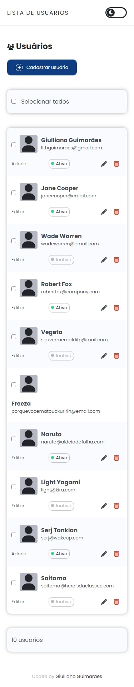
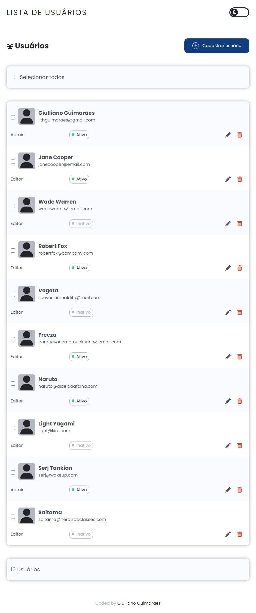
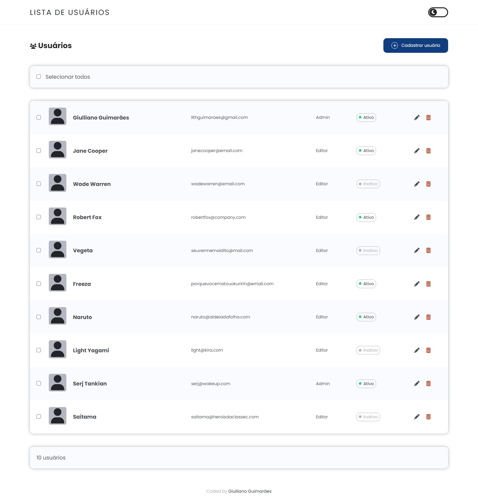

# Lista de Usuários

Este projeto consiste em uma lista de usuários, nela contém ações para cadastro, leitura, edição e exclusão de dados. O objetivo é começar a colocar em prática funcionalidades do CRUD com JavaScript.

Para o armazenamento dos dados foi utilizado o [Firebase Realtime Database](https://firebase.google.com/docs/database), ferramenta disponibilizada pelo Google que armazena dados no formato JSON.

## Layout

O layout foi construído seguindo o método *mobile-first*, conforme apresentado a seguir:



*Layout em 375px*

---



*Layout em 768px*

---



*Layout em 1440x*

---

Confira o deploy aqui: []()

## Ferramentas e tecnologias utilizadas

Esse projeto foi construído com VS Code, em conjunto com as extensões Live Server e Live Sass Compiler.

Foram utilizadas as seguintes tecnologias:

- HTML5
- CSS3
- Sass
- JavaScript
- Firebase Realtime Database

## Instalação

Para baixar e instalar os arquivos do projeto:

1. Abra com Visual Studio Code, e ative as extensões Live Server e Live Sass Compiler.
2. Na extensão Live Sass Compiler, clique no ícone de engrenagem, Configurações de extensão e Editar em settings.json.
3. No arquivo ```settings.json``` acrescente os seguintes parâmetros:
```
"liveSassCompile.settings.formats":[ 
    {
        "format": "expanded",
        "extensionName": ".css",
        "savePath": "assets/styles/css"
    },
    {
        "format": "compressed",
        "extensionName": ".min.css",
        "savePath": "assets/styles/css"
    },
```
4. Para o banco de dados, crie gratuitamente um banco de dados do [Firebase Relatime Database](https://firebase.google.com/) com o nome ```usuarios-crud```. Será usado o trecho de código para instalação na área 'Configurações do SDK', na aba 'CDN'.
5. Crie um arquivo ```connect.js``` dentro de ```assets/scripts/firebase/``` (Se não existir, crie a pasta ```firebase```).
6. Dentro de ```connect.js``` cole o código de instalação do SDK, e estruture da seguinte forma:
```
// Import the functions you need from the SDKs you need
import { initializeApp } from "https://www.gstatic.com/firebasejs/9.13.0/firebase-app.js";
import { getDatabase, ref, set, get, child, update, remove } from "https://www.gstatic.com/firebasejs/9.13.0/firebase-database.js";

(function () {
    // TODO: Add SDKs for Firebase products that you want to use
    // https://firebase.google.com/docs/web/setup#available-libraries

    // Your web app's Firebase configuration
    const firebaseConfig = {
        [ Suas configurações ]
    };

    // Initialize Firebase
    const app = initializeApp(firebaseConfig);
})()
const database = getDatabase();

export { database, ref, set, get, child, update, remove };
```
6. Salve e aproveite o código.